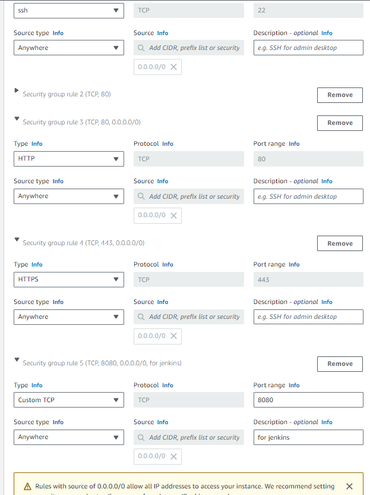
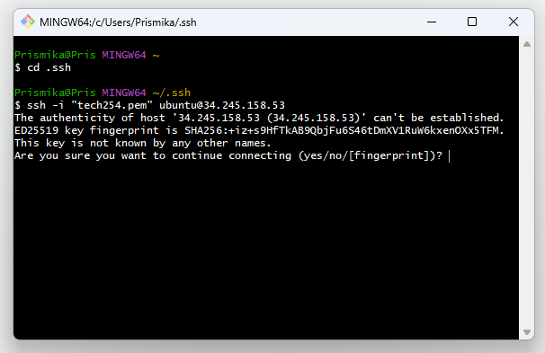
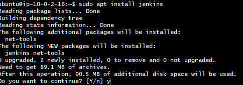
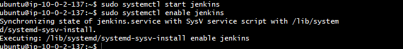
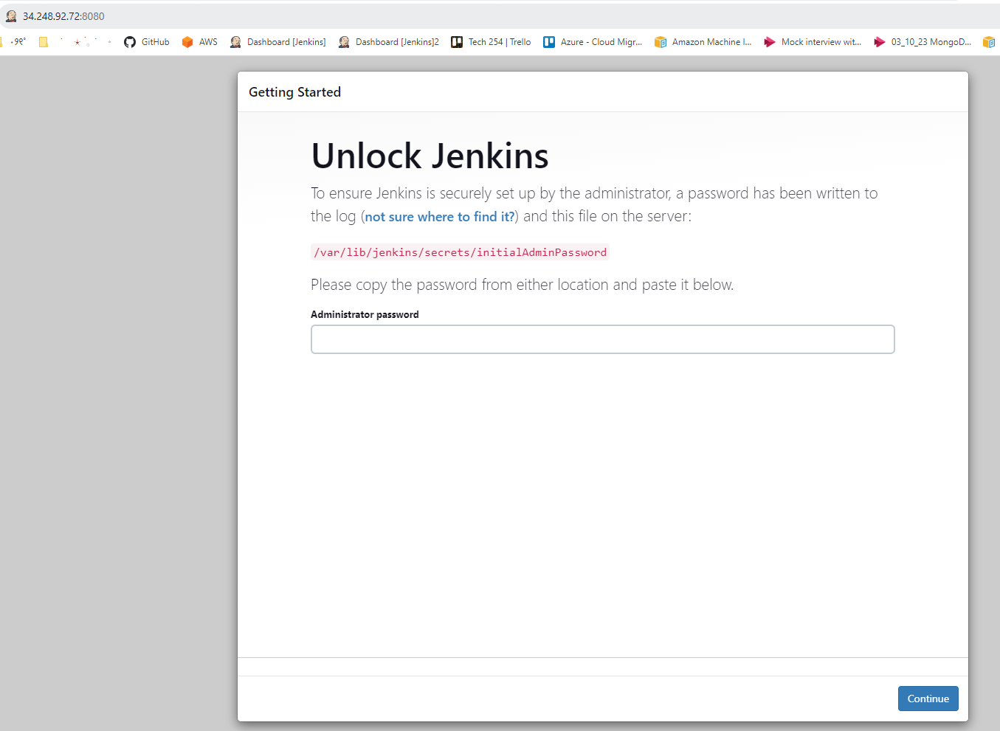
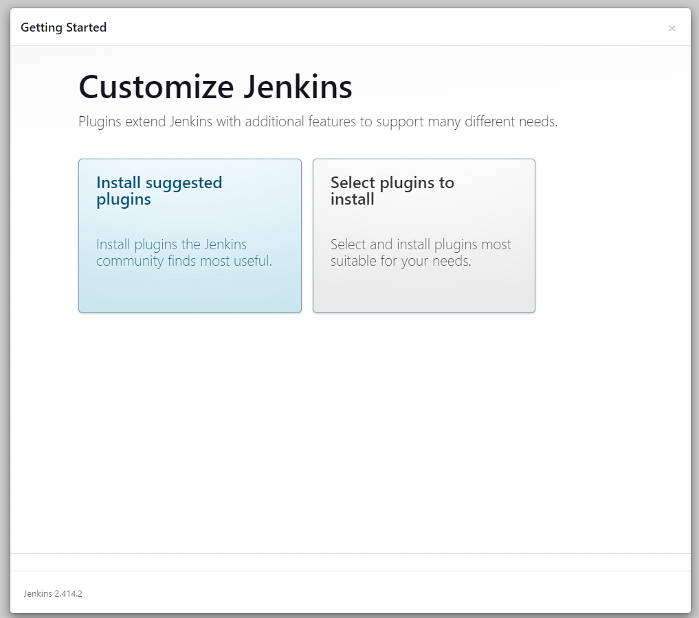
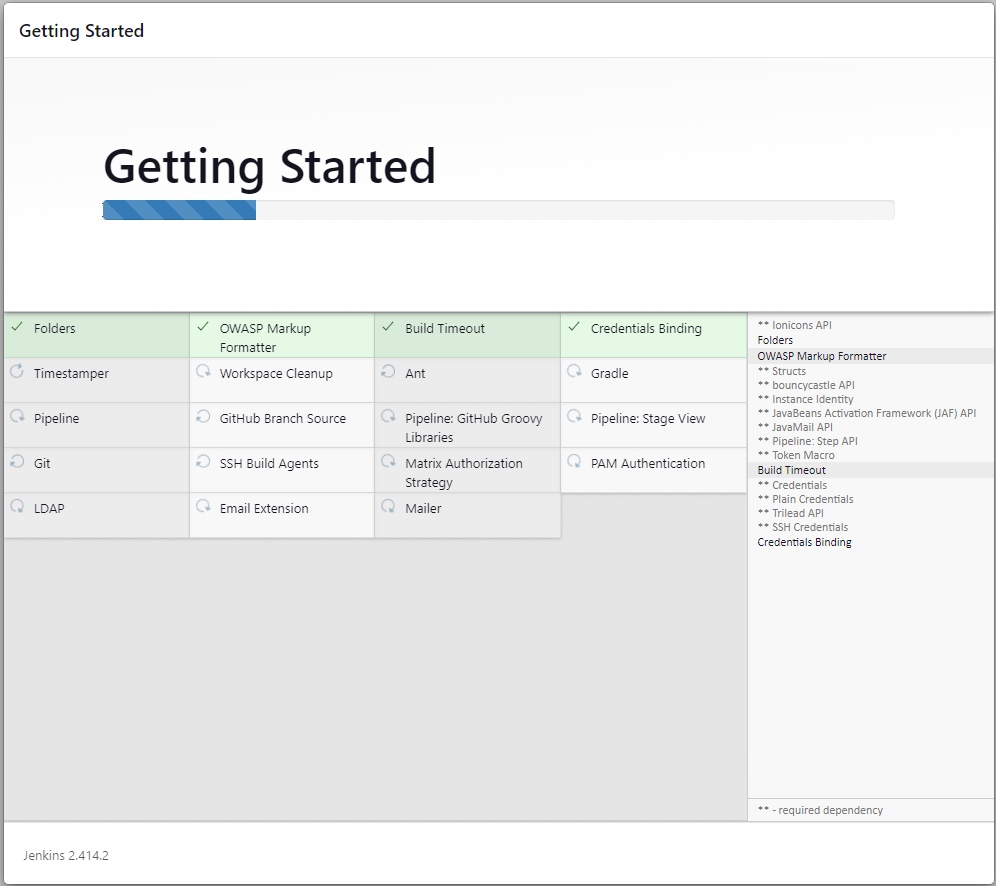
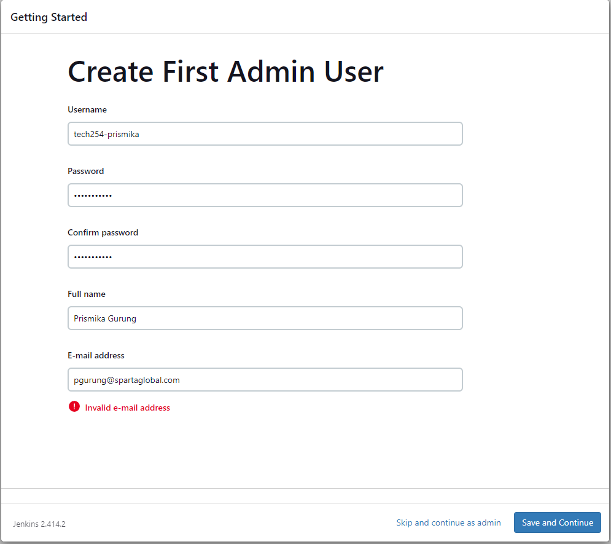
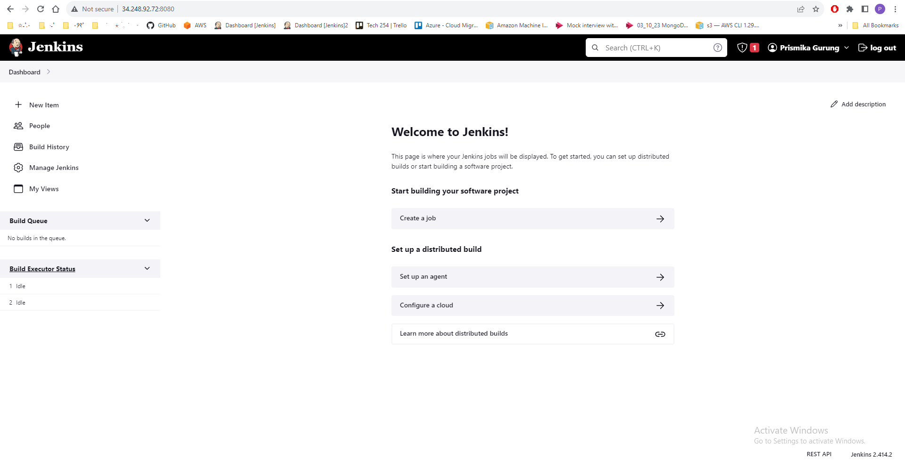
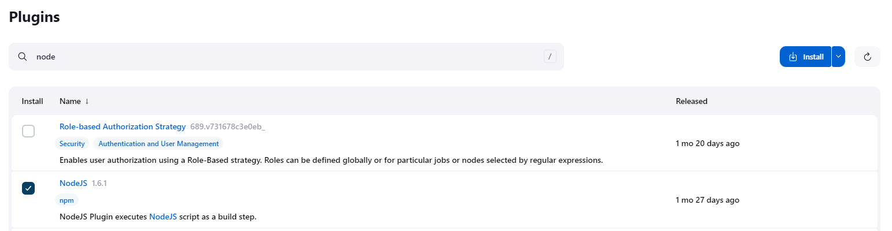

# Setting up Jenkins build environment on EC2

In this document, I will be going through how to setup the build environment by deploying Jenkins on EC2. 

## Step 1: Launch EC2 Instance
- Log into our AWS console. Create new instance followed by adding a suitable name. 

  

- Select **20.04 lts** for the AMI.


- **Key pair** - select Tech254
- **Instance type**- t2.micro or t2.medium. 
- **Network settings** - Click edit on top right. On VPC required, select the **VPC** we created. For subnet, choose the public-subnet. This means that the instance will be launched in the public subnet of your VPC. Enable "Auto-assign Public IP". This ensures that the instance will be assigned a public IP address.
  
  

- **Create security group** - since we want to **allow connections to Jenkins**, we will need to create a new Security Group with the necessary rules. I have allowed inbound traffic for SSH, HTTP and port 8080 for Jenkins. 

  
   
- After your instance has been created, we will connect to it!

## Step 2: SSH into EC2 Instance and Install Jenkins

- Open Gitbash terminal and ssh into our instance. 
  
    

- Before we install Jenkins, we need to update the package manger and also **install Java**, Jenkins is built on Java, which means it requires Java to run.: 

  ``` bash
  # Update the package manager
  sudo apt update

  # Install Java
  sudo apt install openjdk-11-jdk
  ```

- Add the Jenkins repository key, after running command, should get OK output.
  ```bash
  ubuntu@ip-10-0-2-16:~$ wget -q -O - https://pkg.jenkins.io/debian-stable/jenkins.io.key | sudo apt-key add -
  OK
  ```
 - Add the Jenkins repository to sources:
  
   ```bash
   sudo sh -c 'echo deb https://pkg.jenkins.io/debian-stable binary/ > /etc/apt/sources.list.d/jenkins.list
   ```

- Now we need to update the package manager and their versions : 

  ```bash
  sudo apt update
  ```

- Install Jenkins package into your system : 
  
   ```bash
  sudo apt install jenkins
  ```
   

- Then running this commands starts the Jenkins service, allowing you to access Jenkins via web browser
  
  ```bash
  sudo systemctl start jenkins
  ```

- Finally, This command configures Jenkins to start automatically when the system boots up.
  
  ```
  sudo systemctl enable jenkins
  ```
  
After running these commands, Jenkins should be installed and running. You can access the Jenkins via web by copying your public ip address of your EC2 instance followed by :8080 after, for example http://34.248.92.72:8080/

## Setting up Jenkins 

- Now that our Jenkins is up and running in our EC2 build environment. We can access via web through our EC2 public ip and jenkins port. 
This is the page we should see. 

  

- We can access the password through our gitbash terminal by running this command: 

   ```bash
   ubuntu@ip-10-0-2-137:~$ sudo cat /var/lib/jenkins/secrets/initialAdminPassword
   ```
- After entering your passsword. You should see Customize Jenkins page, select **Install suggested plugins**. 
  
  

  

- It should then prompt us to add the following details, enter details in the field followed by **save and continue**.
  
  

- At this point you should be able to see the following page: Jenkins home page.
  
  


## Install Jenkins Plugins

- We will need to add some plugins, in order to build our first job successfully.  
   - **Nodejs** - This enables Jenkins to execute Node.js scripts. 
   - **Office 365 connector (Webhook)** - allows Jenkins to receive notifications from other systems (GitHub), this enables Jenkins to trigger jobs. 
   - **SSh agent** - allows you to use a specific SSH key for authentication when connecting to remote servers in your Jenkins jobs.
  
- At the Jenkins home page on the left hand select Manage Jenkins -> Manage Plugins select the tab Available and search for the following plugin followed by the ones listed above:

   

  ## Configuring Plugins