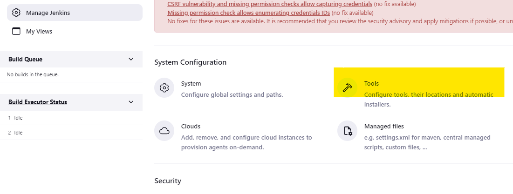
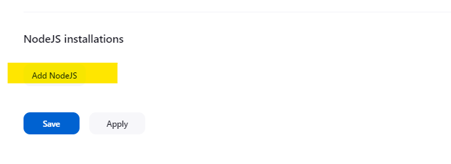
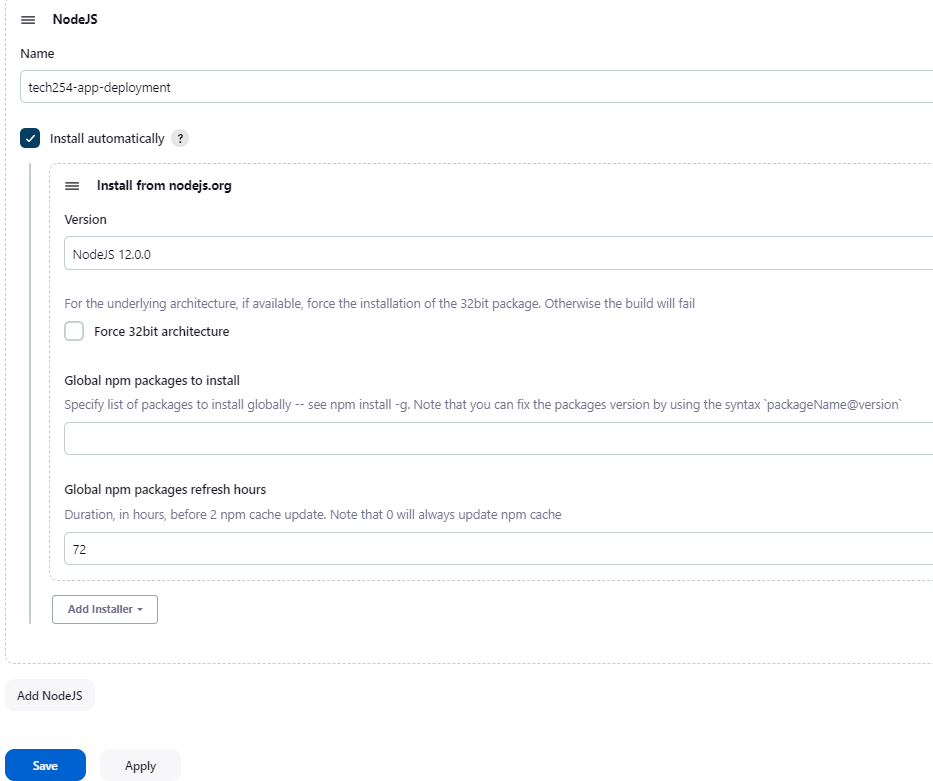

# Building Jenkins Environment 

Once the Jenkins server is set up, you'll need to configure it to suit your specific needs, such as installing plugins, configuring security settings, setting up SSH keys etc. 
.

- Now that our Jenkins is up and running in our EC2 build environment. We can access via web through our EC2 public ip and jenkins port. 
This is the page we should see. 

  

- We can access the password through our gitbash terminal by running this command: 

   ```bash
   ubuntu@ip-10-0-2-137:~$ sudo cat /var/lib/jenkins/secrets/initialAdminPassword
   ```
- After entering your passsword. You should see Customize Jenkins page, select **Install suggested plugins**. 
  
   

   

- It should then prompt us to add the following details, enter details in the field followed by **save and continue**.
  
  

- At this point you should be able to see the following page: Jenkins home page.
  
  


## Install Jenkins Plugins

- We will need to add some plugins, in order to build our first job successfully.  
   - **Nodejs** - This enables Jenkins to execute Node.js scripts. 
   - **Office 365 connector (Webhook)** - allows Jenkins to receive notifications from other systems (GitHub), this enables Jenkins to trigger jobs. 
   - **SSh agent** - allows you to use a specific SSH key for authentication when connecting to remote servers in your Jenkins jobs.
  
- At the Jenkins home page on the left hand select Manage Jenkins -> Manage Plugins select the tab Available and search for the following plugin followed by the ones listed above:

   

  ## Configuring Plugins

  When you install plugins like NodeJS in Jenkins, you typically need to configure them before you can use them in your Jenkins jobs. 

- Go to "manage jenkins" on the side bar and select **Tools**. 

   

- Scroll down to **NodeJS installations** and select **Add NodeJS**

  

- Give it a name i.e *tech254-app-deployment* and under Version, since my app.js only supports version 13 and under, I have selected **NodeJS 12.0.0**. Finally, save your settings. 
  
   

## SSH Host Key Verification

We need to add the public key of github to our known host file to verify the authenticity when we connect to it via SSH.
We can do this through our gitbash terminal, you would run these commands on the EC2 instance where Jenkins is hosted.

The first command switches the current user to jenkins.
The second command contacts Github and retrives the public key. Then it adds the public key to the known_hosts file for the jenkins user.
<br>

This is useful for running automated processes that interact with your GitHub repositories.

   ```bash
   sudo su - jenkins
   ssh-keyscan github.com >> ~/.ssh/known_hosts
   ```
  