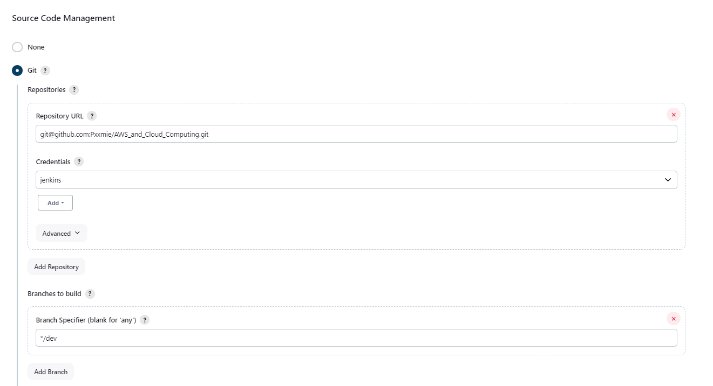
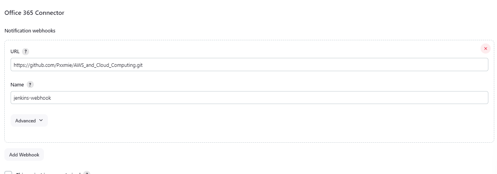

# Building CI/CD Pipeline with Jenkins

Now that we have created our Jenkins build environment, we will build our CI/CD pipeline. 

A **CI/CD pipeline** is a set of automated steps that code goes through from **development** to **deployment**. The pipeline is responsible for building codes, running tests and deploying new software versions.

## Create first job

- On your Jenkins dashboard, click new item. Fill in a suitable name for your first job followed by selecting freestyle project. 
  
  

- On the general settings, lets add a brief description. Select GitHub project > go to your GitHub and copy your Repo url onto this field. 

  

- Under Source Code management, we want to enable Git > add our GitHub repo SSH url followed by selecting our SSH key we have created earlier. As we want to work on dev branch enter the branch specifier to be dev. 
  
   Please refer to this document to find out how to [Configure SSH authentication between GitHub and Jenkins.](**https://github.com/Pxxmie/CI_CD/blob/main/SSH_authentication_GitHub_Jenkins.md**)

   

- Adding a webhook, allows us 
 
  