# Building CI/CD Pipeline with Jenkins

Now that we have created our Jenkins build environment, we will build our CI/CD pipeline. 

A **CI/CD pipeline** is a set of automated steps that code goes through from **development** to **deployment**. The pipeline is responsible for building codes, running tests and deploying new software versions.

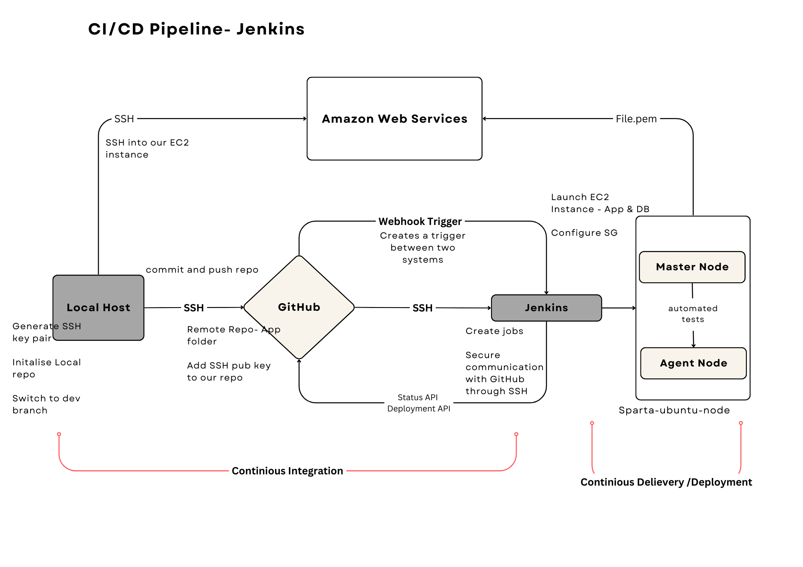

## Creating first job - Local Host to Dev Branch

- On your Jenkins dashboard, click new item. Fill in a suitable name for your first job followed by selecting freestyle project. 
  
  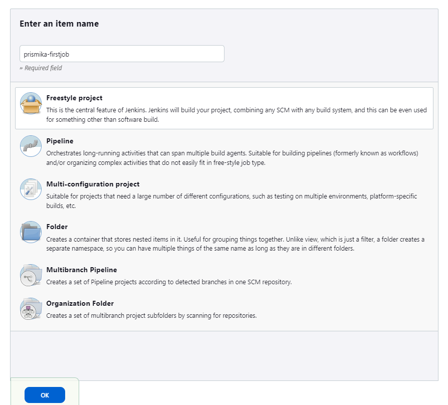

- On the general settings, lets add a brief description. Select GitHub project > go to your GitHub and copy your Repo url onto this field. 

  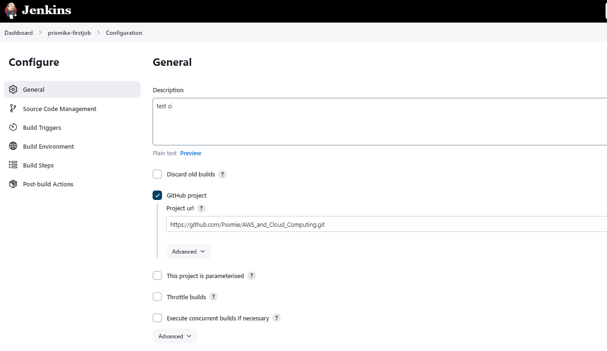

- Under Source Code management, we want to enable Git > add our GitHub repo SSH url followed by selecting our SSH key we have created earlier. As we want to work on dev branch enter the branch specifier to be dev. 
  
   Please refer to this document to find out how to [Configure SSH authentication between GitHub and Jenkins.](**https://github.com/Pxxmie/CI_CD/blob/main/SSH_authentication_GitHub_Jenkins.md**)

   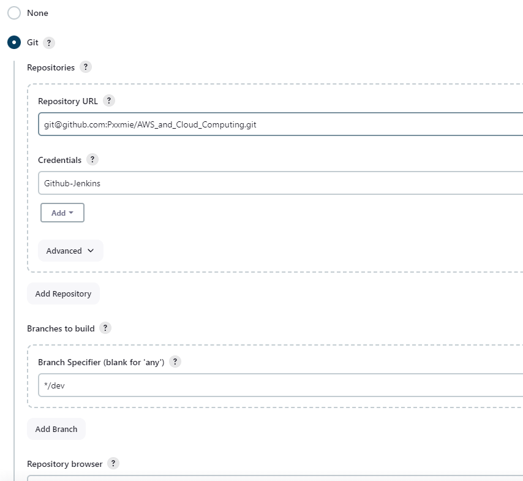

- We want to enable Github hook trigger for GITScm polling so whenever there's a new commit or push to the GitHub repository, GitHub will notify Jenkins through the webhook. I have also selected Provide Node and NPM bin/folder to Path. Enabling this allows Jenkins to execute Node.js scripts and run other tasks related to Node.js development. 
  
  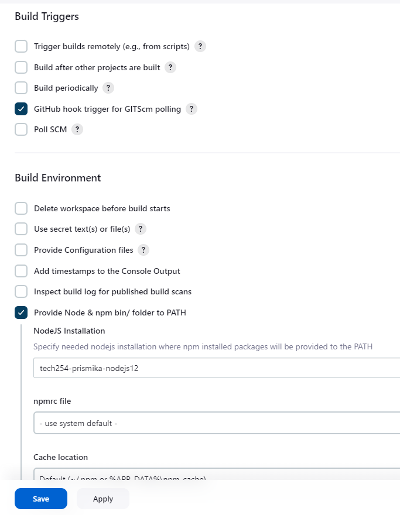

-  I have added execute shells from the drop down under Build steps. Running these commands will install all the required dependencies for my Node.js app followed by running the tests.
  
   ```
   cd app/app
   npm install 
   npm test
   ```

   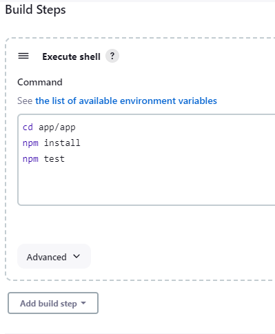

   Finally, we need to add some post-build steps. Select your second job from the drop down list and select trigger only if build is stable. This allows the second job to build upon successfully passing test for the first job. Click save.

    *note that this is only added after you have created second job*

    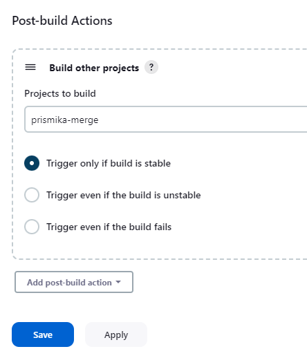

   ## Creating Second Job - Merge Dev to Main

   I have created a second job specifically for merging code from the dev branch to the main branch. This ensures that code changes from the development branch are integrated and tested before they're merged into the main branch.

  - Create new job, give it suitable name ie prismika-merge followed by clicking on freestyle project. Then scroll down to source code management, click on add additional behaviour and select merge before build. By adding the "merge before build" behavior, we are automating the process of merging the development branch into the main branch.
  
    
  
    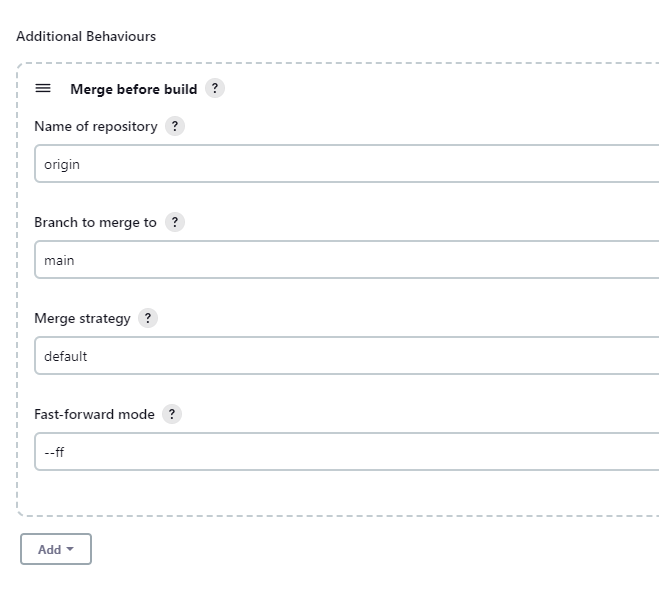

- Finally, on post build actions, we need to select **Git publisher** from the drop down. Click on **push only if build succeeds** folowed by **merge results**. This step allows Jenkins to interact with our Git repository and it ensures that the code will only be pushed to the repository if the build is successful. By clicking on Merge Results it confirms that the merge operation was successful.
  
  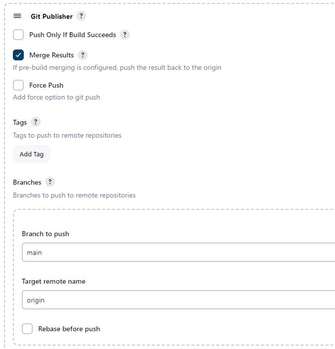


- In the post build actions, we are going to select build other projects, this means after my second job (merging code from dev to main) successfully merges, it triggers the next job in the pipeline to start automatically. This ensures that the merged code is then further tested and built.
  
  

  ## Creating Third Job - Running Nginx Server 

  This job is responsible for deploying the nginx web server and implements continious deployment. 

- First, we will create a new item, I have called this *prismika-cd* followed by selecting freestyle project. I have linked my github project url followed specifing my branch as main. 

  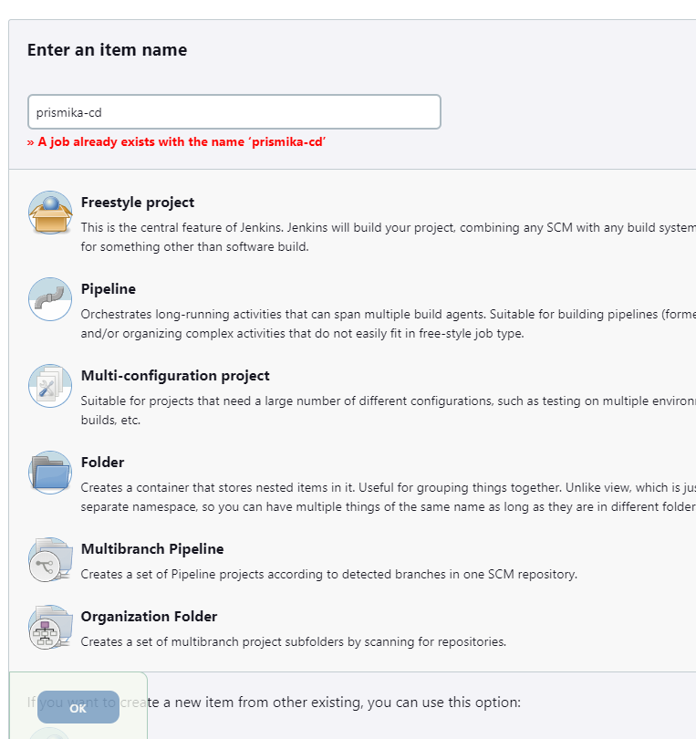

- I have selected GitHub hook trigger. Additionally, by configuring the SSH Agent with my PEM file, I've established a secure connection between Jenkins and my EC2 instance. This will allow me to deploy my nginx server on my EC2 instance securely.
  
  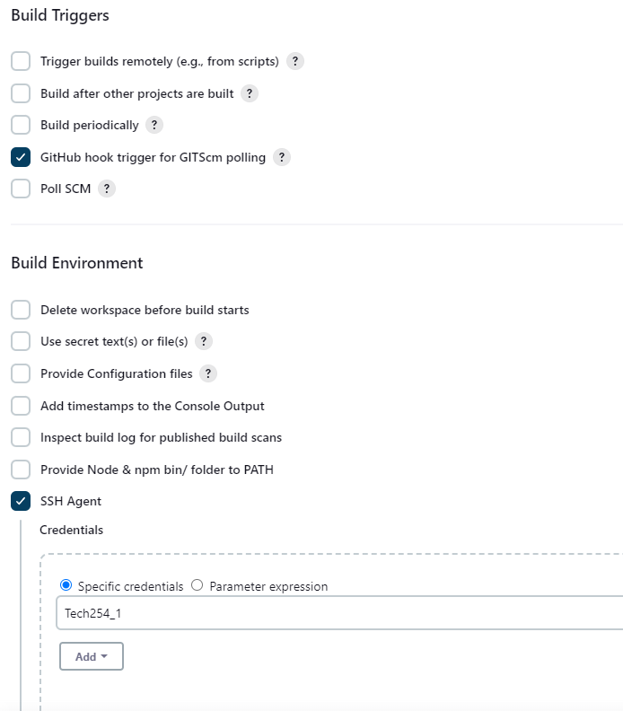

- Now, we will add the build step and select execute shell.This script is responsible for synchronising files, establishing an SSH connection, and executing commands on the instance. 

  ```
  # synchronises files between your local machine and a remote server using SSH.
  rsync -avz -e "ssh -o StrictHostKeyChecking=no" app ubuntu@<ipaddress>:/home/ubuntu/
  
  # establishes an SSH connection 
  ssh - A -o "StrictHostKeyChecking=no" ubuntu@<ipaddress> <<EOF

  # Updates the package list 
  sudo apt-get update -y

  # Upgrades all installed packages to their latest versions.
  sudo apt-get upgrade -y

  # Installs the nginx web server.
  sudo apt-get install nginx -y

  # Restarts the nginx service.
  sudo systemctl restart nginx

  # Enables the nginx service to start automatically on boot.
  sudo systemctl enable nginx

  EOF
  ```
- Finally, I have added a post build action to trigger the next job upon successful build.
  
  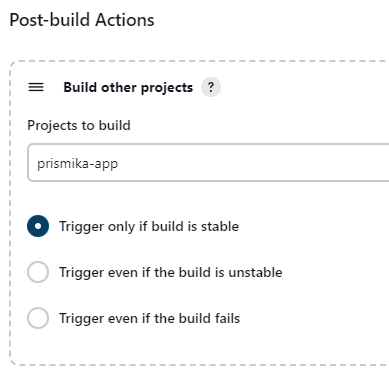

### Testing 

  Go onto your EC2 instance where Jenkins is hosted and copy the public IP address onto the browser. You should be able to see the nginx server running. 

  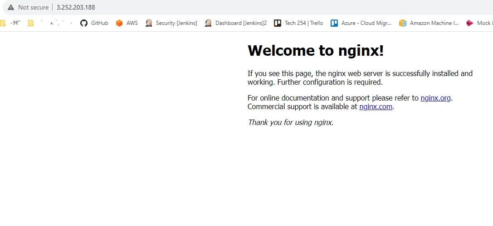
  ## Creating Fourth Job- App deployment 

  We will create our fourth job, which will deploy our app.js on port 3000. 

- Lets keep all our job configuration the same as our third job. 
   - Link GitHub project url 
   - Add GitHub repo ssh link & select the private key. 
   - Select GitHub hook trigger (webhook)
   - Enable SSH agent - select SSH key to establish authentication with Instance. 

- Finally, we will add execute shell to run our app.js app on our instance. This script automates the process of deploying your Node.js application on the EC2 instance.
  
  ```
    # SSH into ec2
    ssh -A -o "StrictHostKeyChecking=no" ubuntu@<ipaddress> <<EOF

	# install nodejs 12.x
	curl -sL https://deb.nodesource.com/setup_12.x | sudo -E bash -
	sudo apt install nodejs -y

	# install pm2 
	sudo npm install pm2 -g

	# install git
	sudo apt install git -y

	# install the app 
	cd app
	npm install

	# start the app (could also use 'npm start')
	pm2 start app.js
    
    EOF
  ```


 ### Testing

  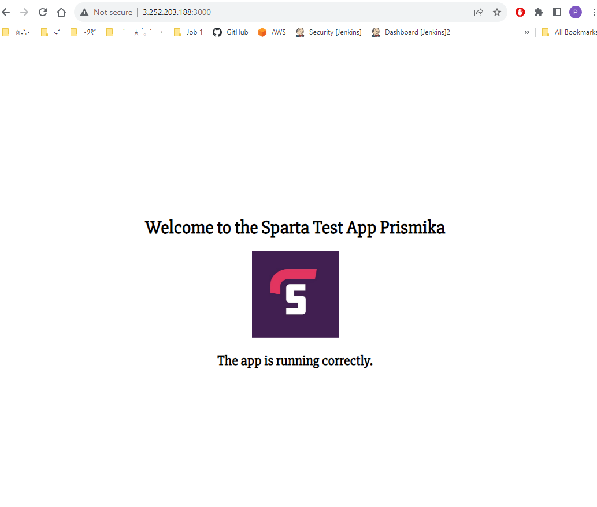