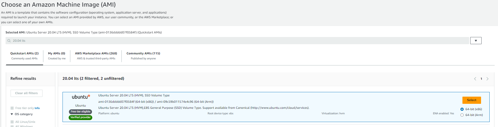
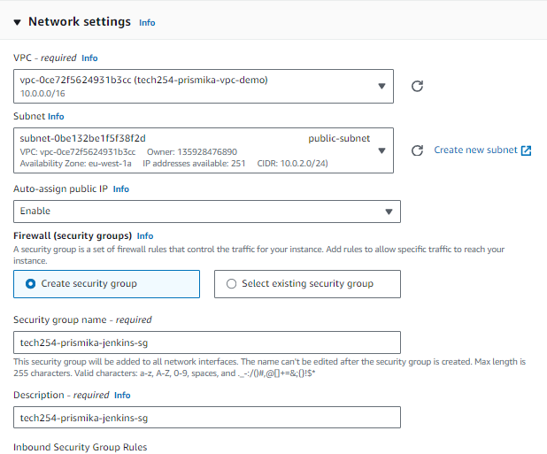
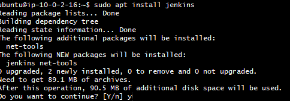
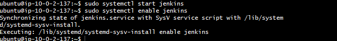

# Building Jenkins on EC2

In this document, I will be going through how to setup the build environment by deploying Jenkins on EC2. 

This involves setting up the Jenkins server infrastructure, which includes:

- Launching an EC2 instance.

- Installing Jenkins on that server.

This is the process of getting the Jenkins server up and running.


## Step 1: Launch EC2 Instance
- Log into our AWS console. Create new instance followed by adding a suitable name. 

  

- Select **20.04 lts** for the AMI.


- **Key pair** - select Tech254
- **Instance type**- t2.micro or t2.medium. 
- **Network settings** - Click edit on top right. On VPC required, select the **VPC** we created. For subnet, choose the public-subnet. This means that the instance will be launched in the public subnet of your VPC. Enable "Auto-assign Public IP". This ensures that the instance will be assigned a public IP address.
  
  

- **Create security group** - since we want to **allow connections to Jenkins**, we will need to create a new Security Group with the necessary rules. I have allowed inbound traffic for SSH, HTTP and port 8080 for Jenkins. 

  
   
- After your instance has been created, we will connect to it!

## Step 2: SSH into EC2 Instance and Install Jenkins

- Open Gitbash terminal and ssh into our instance. 
  
    

- Before we install Jenkins, we need to update the package manger and also **install Java**, Jenkins is built on Java, which means it requires Java to run.: 

  ``` bash
  # Update the package manager
  sudo apt update

  # Install Java
  sudo apt install openjdk-11-jdk
  ```

- Add the Jenkins repository key, after running command, should get OK output.
  ```bash
  ubuntu@ip-10-0-2-16:~$ wget -q -O - https://pkg.jenkins.io/debian-stable/jenkins.io.key | sudo apt-key add -
  OK
  ```
 - Add the Jenkins repository to sources:
  
   ```bash
   sudo sh -c 'echo deb https://pkg.jenkins.io/debian-stable binary/ > /etc/apt/sources.list.d/jenkins.list
   ```

- Now we need to update the package manager and their versions : 

  ```bash
  sudo apt update
  ```

- Install Jenkins package into your system : 
  
   ```bash
  sudo apt install jenkins
  ```
   

- Then running this commands starts the Jenkins service, allowing you to access Jenkins via web browser
  
  ```bash
  sudo systemctl start jenkins
  ```

- Finally, This command configures Jenkins to start automatically when the system boots up.
  
  ```
  sudo systemctl enable jenkins
  ```
  
After running these commands, Jenkins should be installed and running. You can access the Jenkins via web by copying your public ip address of your EC2 instance followed by :8080 after, for example http://34.248.92.72:8080/
